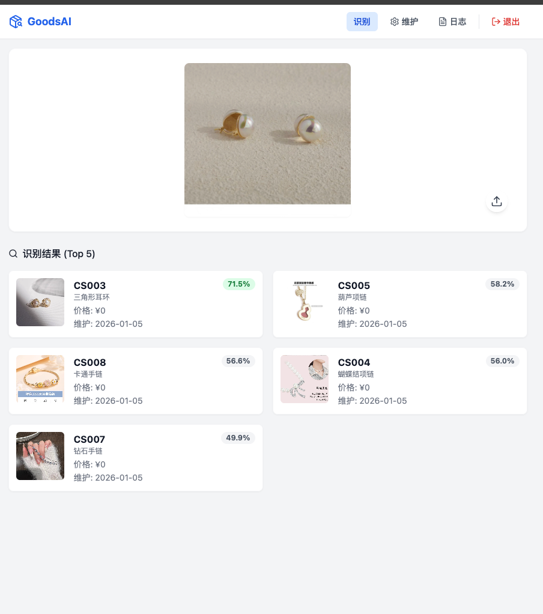
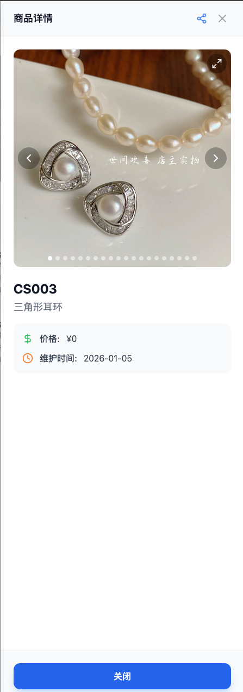
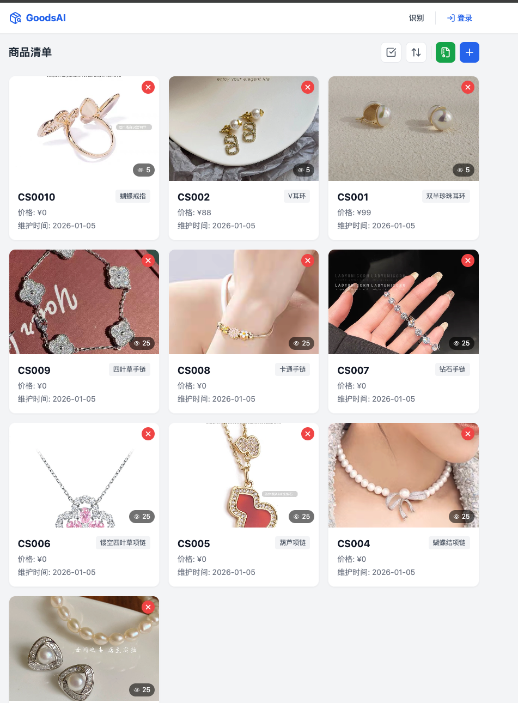
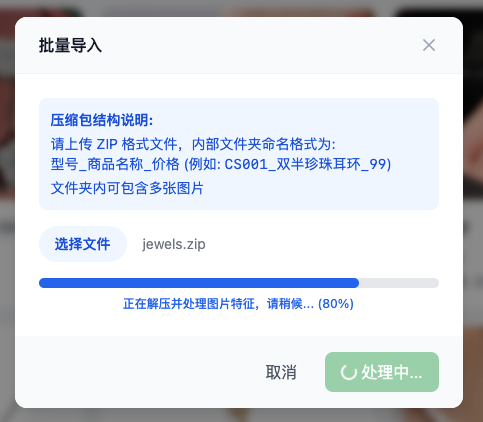

# GoodsAI - 商品归类识别系统

基于 MobileNetV3 特征提取与向量检索的智能商品识别系统。提供商品图像检索、后台管理、权限控制及日志审计功能。

## ✨ 功能特性

### 1. 商品识别 (User)
- **以图搜图**：支持上传图片或拍照，通过 AI 提取特征并在库中搜索最相似商品。
- **Top 5 匹配**：展示相似度最高的 5 个结果，并显示匹配置信度。
- **详情查看**：支持查看商品高清大图（画廊模式）及详细信息。
- **一键分享**：生成商品详情页链接，方便分享传播。




### 2. 商品管理 (Admin)
- **CRUD 管理**：商品的增删改查，支持多图管理、图片拖拽排序。
- **批量导入**：支持上传 ZIP 压缩包批量导入商品及图片（目录结构：`型号_名称_价格`）。
- **批量操作**：支持批量选择、批量删除商品。
- **排序筛选**：支持按日期、价格、名称等多种维度排序。



### 3. 系统管理
- **权限控制**：
  - **管理员**：拥有完整权限（商品管理、日志查看）。
  - **普通用户**：仅限商品识别和查看。
  - **访客**：仅限查看公开的商品详情页。
- **日志审计**：记录关键操作日志（登录、增删改、导入等），支持按时间清理。

## 🛠 技术栈

- **前端**：Vue 3, Vite, Tailwind CSS, Lucide Icons
- **后端**：Python FastAPI, SQLite
- **AI 模型**：MobileNetV3 Small (ImageNet 预训练)，轻量级高效特征提取
- **依赖库**：`torch`, `torchvision`, `Pillow`, `python-jose`, `passlib`, `bcrypt`

## 🚀 快速开始

### 1. 启动后端 (Server)

建议使用 Python 虚拟环境 (venv39)。

```bash
cd web/server

# 1. 创建并激活虚拟环境
python3 -m venv venv39
source venv39/bin/activate
# Windows: .\venv39\Scripts\activate

# 2. 安装依赖
pip install -r requirements.txt

# 3. 启动服务 (默认端口 8000)
python main.py
```

### 2. 启动前端 (Client)

需要安装 Node.js (推荐 v16+)。

```bash
cd web/client

# 安装依赖
npm install

# 启动开发服务器 (默认端口 5173)
npm run dev
```

若需修改后端 API 地址，请编辑 `web/client/public/config.js`。

## 🔐 默认账号

系统初始化时会自动创建以下默认账号：

| 角色 | 用户名 | 密码 | 权限 |
|------|--------|------|------|
| **管理员** | `admin` | `admin123` | 系统维护、日志管理 |
| **普通用户** | `user` | `user123` | 商品识别 |

## 📦 批量导入说明

在维护页面点击“批量导入”按钮，上传 ZIP 压缩包。
压缩包内部目录结构示例：

```text
uploads.zip
├── CS001_双半珍珠耳环_99/
│   ├── 1.jpg
│   └── 2.png
├── CS002_V耳环_88/
│   └── image.jpg
└── CS003_三角形耳环/  (价格默认为0)
    └── photo.jpg
```
- 文件夹命名格式：`型号_商品名称_价格`
- 支持多层级目录，系统会自动扫描所有图片。



## 📝 目录结构

```text
web/
├── server/          # 后端代码
│   ├── main.py      # API 入口
│   ├── database.py  # 数据库操作 (SQLite)
│   ├── model.py     # AI 特征提取模型
│   ├── goods.db     # SQLite 数据库文件
│   └── uploads/     # 图片存储目录
└── client/          # 前端代码
    ├── src/
    │   ├── views/   # 页面组件 (Home, Admin, Login...)
    │   └── components/ # 通用组件
    └── ...
```
